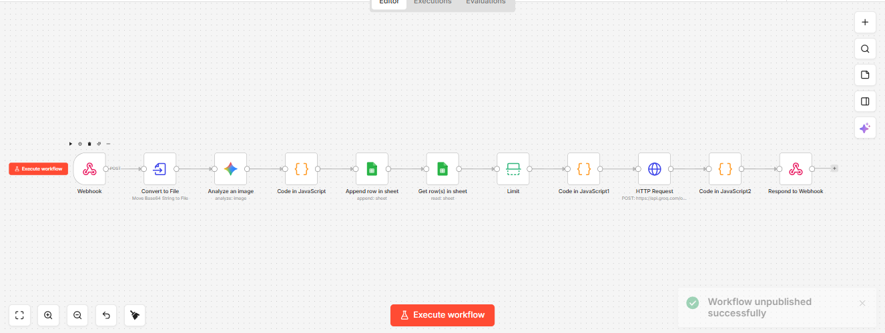
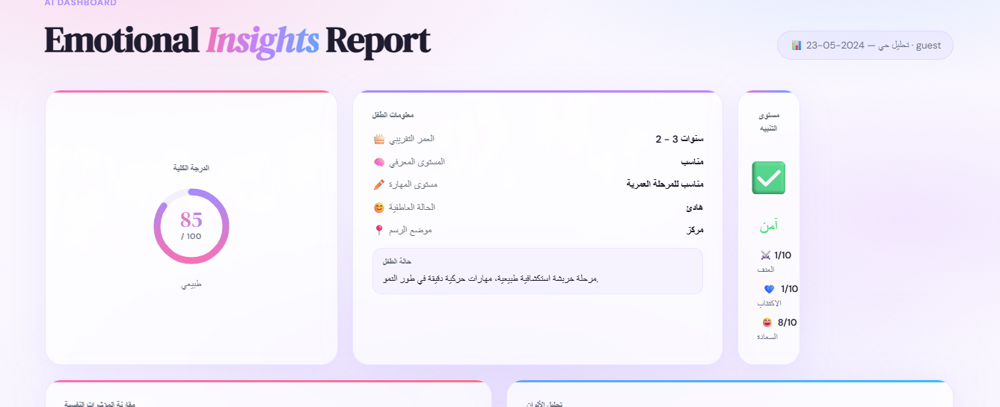
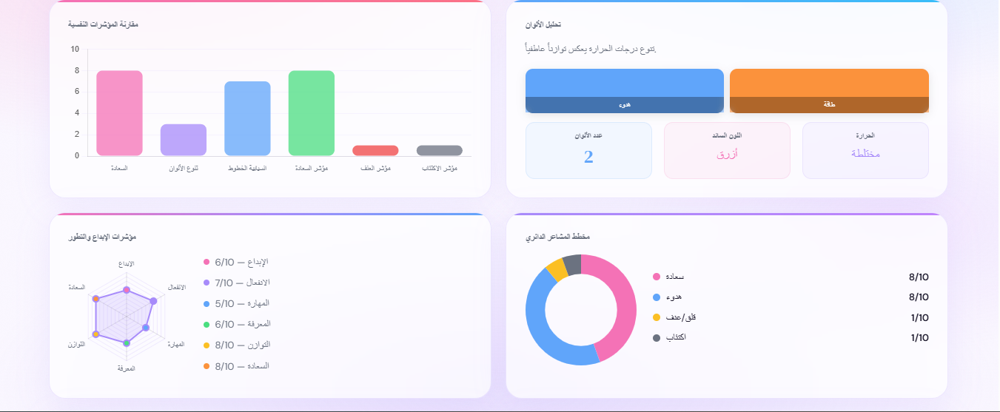
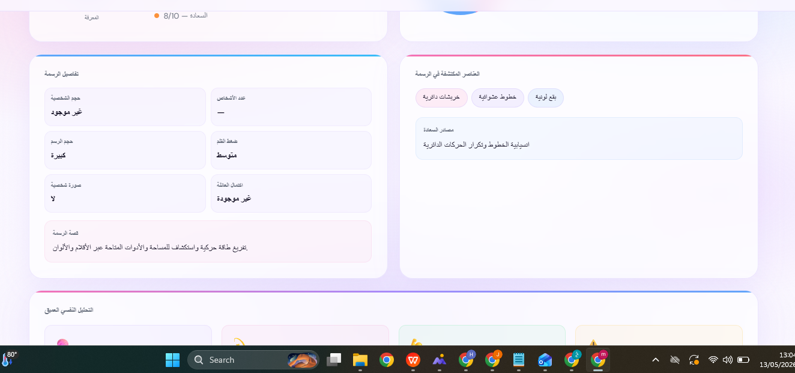
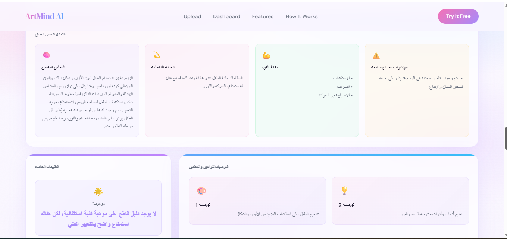

ArtMind AI 🎨

ArtMind AI هو نظام ذكي لتحليل رسومات الأطفال باستخدام الذكاء الاصطناعي بهدف فهم الحالة النفسية والعاطفية للأطفال بطريقة تفاعلية وسريعة.

يقوم النظام بتحليل الرسومات واستخراج مؤشرات نفسية وسلوكية تساعد الأهالي والمعلمين والأخصائيين على فهم مشاعر الطفل واكتشاف المشكلات مبكرًا.

المشكلة

يعاني العديد من الأطفال من صعوبة التعبير عن مشاعرهم بالكلام، لذلك تصبح الرسومات وسيلة مهمة للتعبير عن:

القلق والخوف
الحزن أو العزلة
المشكلات النفسية
الاضطرابات السلوكية
المشاعر الداخلية

لكن تحليل الرسومات التقليدي يحتاج إلى مختصين وخبرة طويلة، مما يؤدي إلى:

تأخر اكتشاف المشكلات النفسية
صعوبة المتابعة المستمرة للأطفال
زيادة السلوك العدواني أو الانعزال بسبب ضعف التواصل
الحل

يوفر ArtMind AI منصة ذكية تقوم بـ:

- رفع رسمة الطفل عبر واجهة ويب سهلة الاستخدام.
- تحليل الرسمة باستخدام الذكاء الاصطناعي.
- استخراج مؤشرات نفسية وعاطفية.
- عرض النتائج داخل Dashboard تفاعلية.
- اقتراح فيديوهات وقصص داعمة من YouTube بناءً على الحالة النفسية.
- تخزين نتائج التحليل لمتابعة تطور الطفل مستقبلًا.

مميزات المشروع:

- تحليل فوري للرسومات
- واجهة استخدام حديثة وتفاعلية
- استخراج مؤشرات نفسية وعاطفية
- Dashboard لعرض النتائج
- تخزين النتائج تلقائيًا
- اقتراح فيديوهات داعمة للأطفال حسب المشاعر المكتشفة
- دعم الاكتشاف المبكر للمشكلات النفسية

التقنيات المستخدمة:

Frontend
- HTML
- CSS
- JavaScript

AI & Image Analysis
- Google Gemini Vision API
- Prompt Engineering

Workflow Automation
- n8n Workflow Automation

 Database
- Google Sheets

RAG System

تم استخدام نظام RAG مزود بأبحاث ومراجع متخصصة في:

تحليل رسومات الأطفال
علم نفس الطفل
مراحل تطور الرسم

وذلك لتحسين دقة التحليل وعدم الاعتماد الكامل على Gemini فقط.

طريقة عمل النظام:

1. يقوم المستخدم برفع صورة الرسمة.
2. يتم إرسال الصورة إلى n8n Webhook.
3. يتم تحليل الصورة باستخدام Gemini AI.
4. يتم دمج نتائج الذكاء الاصطناعي مع قاعدة المعرفة (RAG).
5. يتم إنشاء تقرير نفسي وعاطفي.
6. يقوم النظام باقتراح فيديوهات داعمة مناسبة للحالة النفسية.
7. تُعرض النتائج داخل Dashboard.
8. يتم حفظ النتائج داخل Google Sheets.

أهداف المشروع:

- المساعدة في فهم مشاعر الأطفال
- دعم الاكتشاف المبكر للمشكلات النفسية
- تسهيل عمل الأخصائيين والمعلمين
- توفير أداة ذكية للأهالي

لقطات من المشروع:

مستقبل المشروع:

- دعم تقارير PDF
- إنشاء حسابات للأطفال
- مقارنة الرسومات مع مرور الوقت
- تدريب نموذج ذكاء اصطناعي مخصص
- توصيات فيديوهات مخصصة بالذكاء الاصطناعي
- دعم لغات متعددة

موقع الويبسايت 
https://cosmic-otter-e7a94f.netlify.app/#upload
